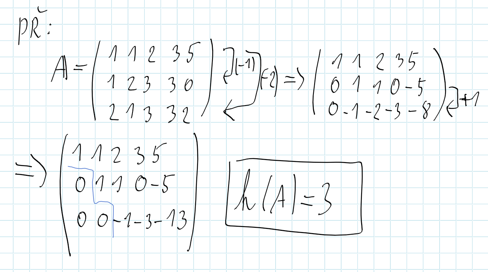
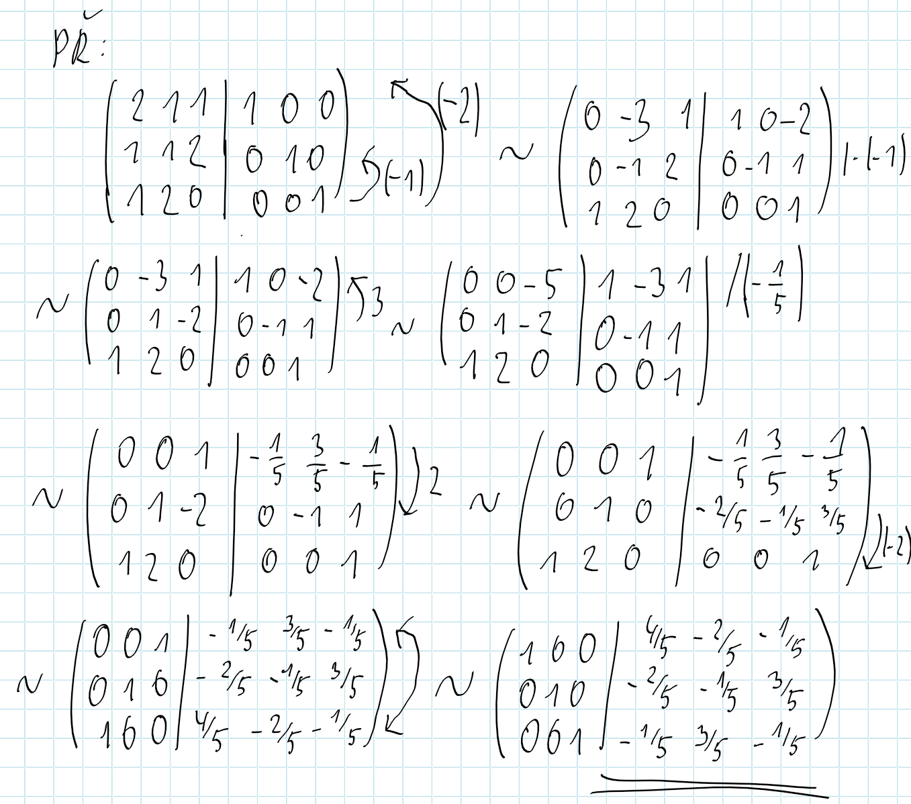
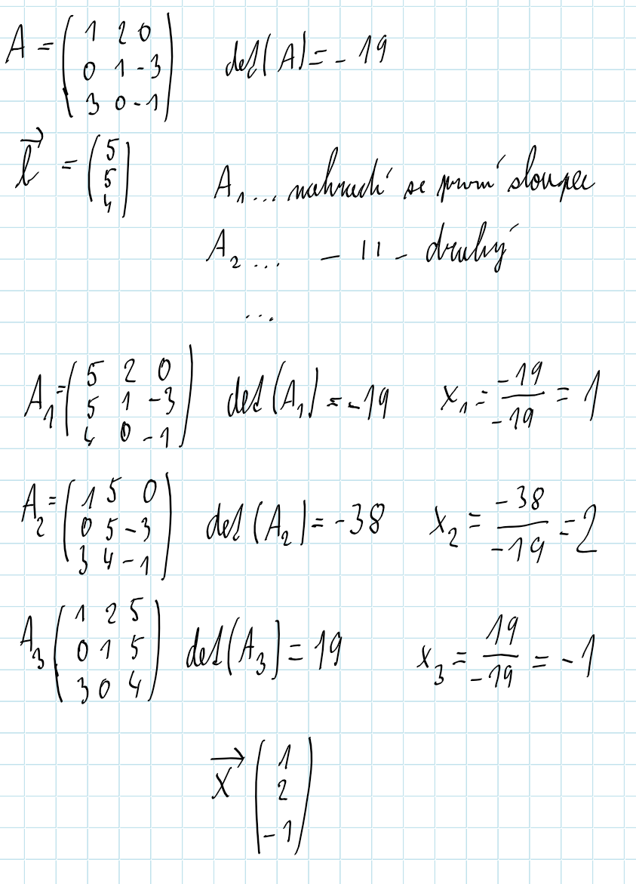

# Matice
$A \in R^{m*n}$ => A je typu (m,n)... m = počet řádků, n = počet sloupců
* $A(n,n)$ = čtvercová matice
* $0$ = nulová matice.. obsahuje pouze nuly
* $E / I$ = Jedničková.. Jedničky jsou na diagonále, !vždy musí být čtverec
* $D / H$ = Dolní/horní trojúhelníková matice (Obsahuje 0 v horním nebo dolním "trojúhelníku")

### Operace
* Rovnost - $A = B$ - jedině pouze jsou všechny čísla ve sloupcích a řádcích stejná     
* Transpozice - $\begin{pmatrix} 1 & 0 & 2 \\ 3 & 4 & 1 \end{pmatrix}^T=\begin{pmatrix} 1 & 3 \\ 0 & 4 \\ 2 & 1\end{pmatrix}$
* $(A^{T})^{T}$ = A
* Skalární násobení - $c * A = c * (A_{ij}$) - každé číslo matice se vynásobí hodnotou c
*  Součet - $A + B$ - jde pouze když jsou stejné $(m,n) = (m,n)$ obou matic, sčítá se každá pozice v matici s tou druhou
*  Odčítání - stejné jako u součtu jen se zapisuje - $A + (-1)*B$
*  Násobení - $A * B = C$    
 Př: 

### Vlastnosti
* $(A + B) + C = A + (B + C)$
---
* $A + B = B + A$
* $c * A = c * A$
* !!!$A * B ≠ B * A$!!!
---
* $A * (B + C) = A * B + A * C$
* $(A + B) * C = A * C + B * C$
---
* $c * (A + B) = c * A + c * B$
* $c * (d * A) = (c * d) * A$
---
* $A * E = E * A = A$
* A * 0 = 0 * A = 0$
---
* $(A + B)^T = A^T * B^T$
* !!!$(A * B)^T = B^T * A^T$!!!

### Determinant
* Platí pouze pro **čtvercovou** matici
* Značí se $|A|$ nebo $det(A)$
* Pokud $det(A) = 0$ - matice je singulární
* Pokud $det(A) ≠ 0$ - matice je regulární

### Vlastnosti
* $det(A) * det(B) = det(A * B)$
* $det(A) = det(A^T)$

### Praxe :)

### Lineární závislost
* "Vlastnosti, kdy se řádky navzájem ovlivňují"

### Lineární řádkové úpravy matic

1. Změna pořadí řádku
2. Řádek vynásobíme nenulovým číslem
3. Ke řádku přičteme lineární kombinaci jiných řádků(samozřejmě se může i násobek)
4. Vypustíme nulový sloupec
### Hodnost

* Určuje počet kolik řádků je "lineárně nezávislých"
* Zjišťuje se úpravou matice do "schodovitého tvaru"

### Inverzní matice
- $A^{-1}$ nebo $inv(A)$, kdy matice $A$ musí být regulární ($det(A)≠0$ => matice musí být čtvercová)
- $A * A^{-1} = A^{-1} * A = E$
- Vytváří se převodem $(A | E) ~ ... ~ (E | A^{-1})$

### Adjungovaná matice
- $A^* = (d_{ij})^T   d_{ij}=(-1)^{i+j}*|A_{ij}|$
- $A^{-1} = \frac {1} {det(A)} * A^*$      
     
       

### Soustava lineárních rovnic
* řešení soustavy linárních rovnic pomocí matic
  
* 2 možnosti výpočtu:
1. Gausova eliminace:      
  
2. Cramelovo pravidlo
   - Matice musí být regulární (determinant nesmí být 0)
  
  - kde matice $A_j$ vznikne z matice $A$ nahrazením j-tého sloupce pravých stran $b$
  

### Frobeirova věta - určuje počet výsledků u lineárních rovnic
* $h(A)<h(A|b)$ - nemá řešení
* $h(A)=h(A|b)=n$ - jedno řešení
* $h(A)=h(A|b)<n$ - nekonečno řešení ($n-h(A)$)

### Maticové rovnice
- reminder:
  1. $A * B ≠ B * A$
  2. $A * E = E * A = A$
  3. $A * A^{-1} = A^{-1} * A = E$
- Poznámky:
  - !!!!NIKDY SE NEDĚLÍ... max se násobí inverzí!!!!
  - Při násobení se hledí na to zda zprava nebo zleva
- Na příkladech:
  1. * $A-B(Cx+D)*F=H$. . . . . $/-A$
     * $-B(Cx+D)*F=H-A$. . . . . $/*(-B^{-1})$ zleva 
     * $+B^{-1}(C*x+D)*F=-B^{-1}*(H-A)$
     * $(Cx+D)*F=-B^{-1}*(H-A)$. . . . .$/*(-F^{-1})$ zprava
     * $Cx+D=-B^{-1}*(H-A)*F^{-1}$. . . . . $-D$
     * $C*x=-B^{-1}*(H-A)*F^{-1}-D$. . . . . $/* C^{-1}$ zleva
     * $x=-C^{-1}[-B^{-1}*(H-A)*F^{-1}-D]$
  2. * $2x+4A=3BA$. . . . . $/-4A$
     * $2x=3BA-4A$. . . . . $/2^{-1} = 1/2$
     * $x=1/2*(3BA-4A)$
  3. * $3A+xB=C+2x$. . . . . $/-3A -2x$ 
     * $xB-2x*E=C-3A$. . . . . "vložíme E, abychom mohli vytknout"  
     * $x(B-2E)=C-3A$. . . . . $/*(B-2E)^{-1}$ zprava
     * $x=(C-3A)*(B-2E)^{-1}$
