### 3 základní druhy:
1. Tolerování délkových rozměrů
2. Tolerování geometrické
3. Tolerování textury povrchu (drsnost)
# Tolerování délkových rozměrů
### Pojmy:
* Jmenovitý rozměr - rozměr, kterému se na výkresu stanoví mezní horní a dolní úchylky
* Skutečný rozměr - rozměr zjištění meřením
---
* Mezní rozměry:
  * Horní mez - největětší dovolený rozměr
    * Dmax - drážka/díra
    * dmax - hřídel
  * Dolní mez - nejmenší dovolený rozměr
    * Dmin - drážka/díra
    * dmin - hřídel
* Rozměrová tolerance (T/t) - rozdíl mezi horní a dolní mezí
  * T = Dmax - Dmin
  * t = dmax - dmin
* Mezní úchylky
  * Horní mezní úchylka - ES/es - rozdíl mezi horním mezním rozměrem a příslušným jmenovitým rozměrem 
  * Dolní mezní úchylka - EI/ei - rozdíl mezi dolní mezním rozměrem a příslušným jmenovitým rozmerem
  
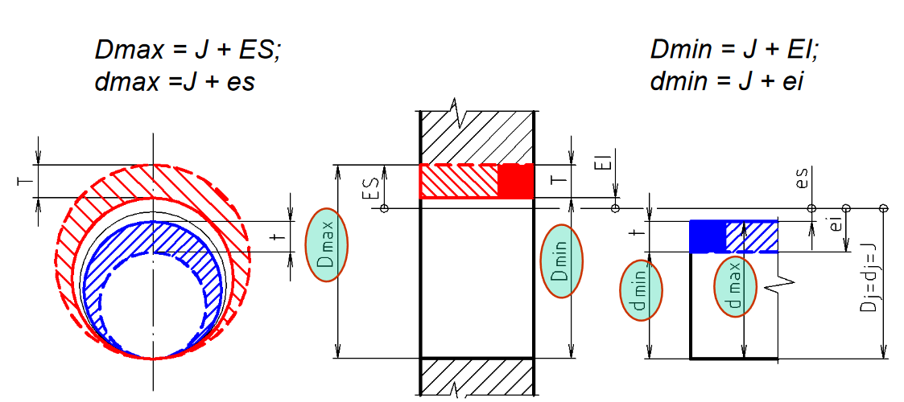
  * Uložení:
    1. Uložení s vůlí - hřídel je menší než díra
    2. Uložení s přesahem - hřídel je větší než díra
    3. Přechodné uložení - záleží na kombinaci přesahů

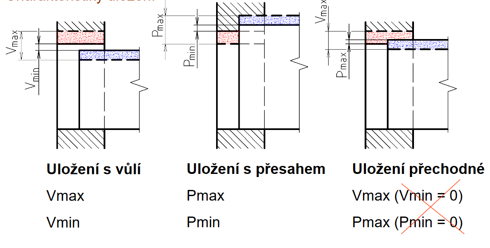
### Pravděpodobná velikost skutečného rozměru
* Ze statistického rozložení vyrobených rozměrů vyplývá, že nejčastěji se vyskytujícím rozměrem je ten, který leží přibližně uprostřed mezi horním a dolním mezním rozměrem
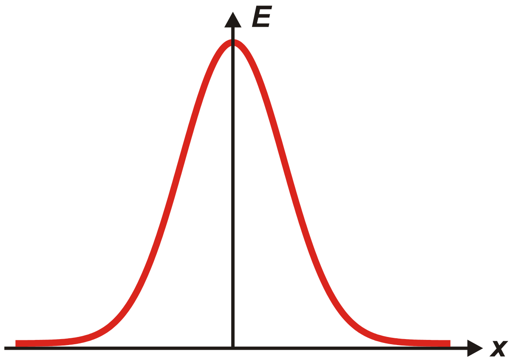

### Mezní kalibry
* nástroje, které rychle zkontrolují skutečný rozměr v toleranci
* využívaj se hlavně u výrobků, kterých se vyrábí hodně
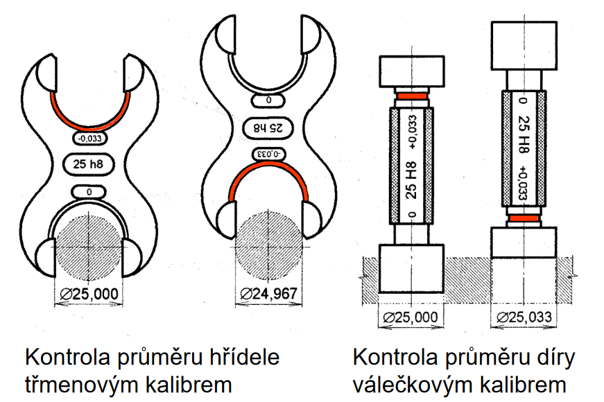

## Normalizovaná tolerance - IT
* každá tolerance uvedená v soustavě tolerancí a uložení ISO
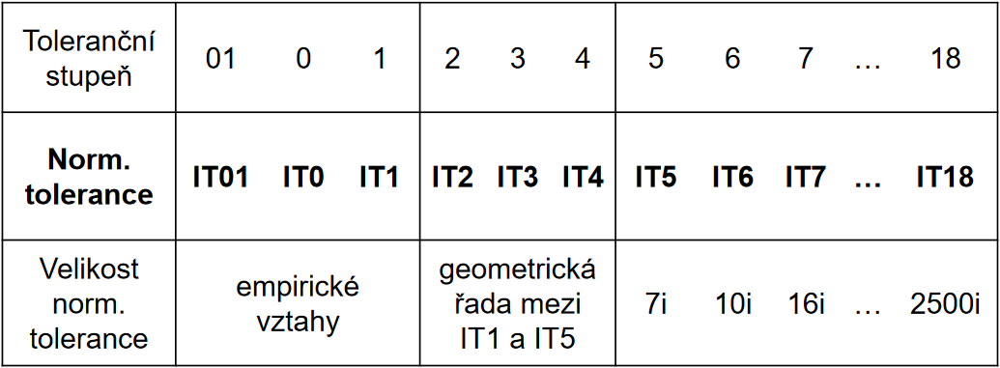
* IT01 - IT4 - slouží převážně pro výrobu kalibrů a měřidel
* IT5 - IT11 - pro uložení v přesném a všeobecném strojírenství
* IT11 - IT18 - pro mezní úchylky netolerovaných délkových rozměrů a 
výrobu polotovarů
## Výpočet IT:
$IT_N=k*i$
* k = násobek
* i = toleranční jednotka ($i=0.45*\sqrt[3]{D}+0,001*D$), kdy $D$ je "průměrná délka $D=\sqrt{(D_1 * D_2)}$
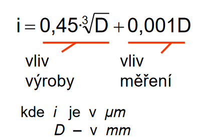
## Přesnost:
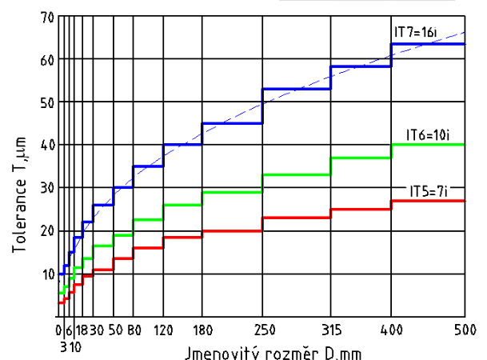

## Základní úchylka
* EI = -es - pro díry se základními úchylkami A až H
* ES = -ei - pro díry se základními úchylkamiJ až ZC
* Speciální je JS/js, které má stejné základní úchylky na obou stranách
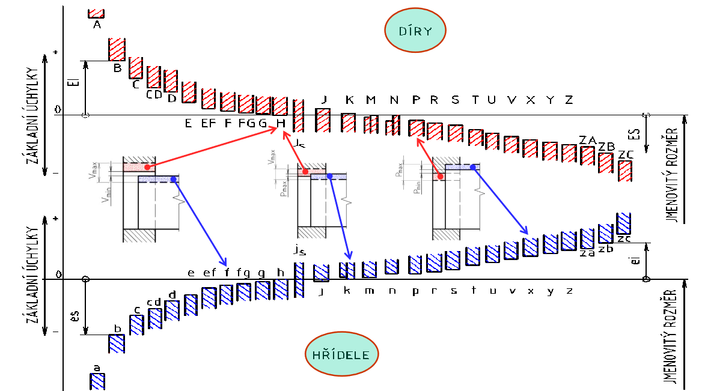

## Zápis a výpočet
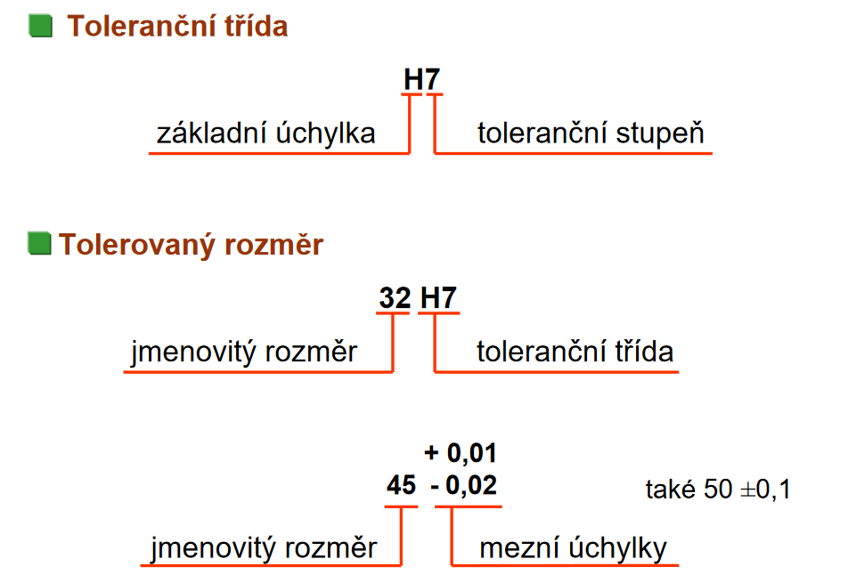
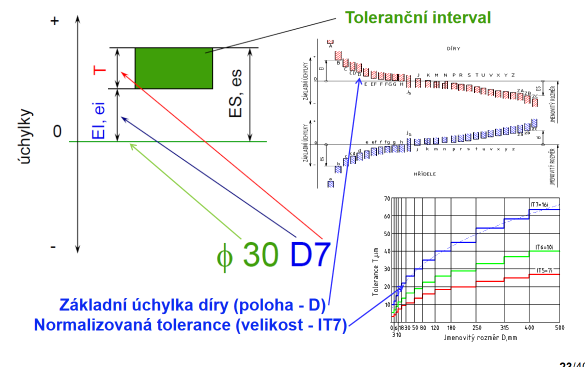

## Uložení
* Základní uložení díry - efektivnější, neboť hřídel se jednoduššeji uravuje než zvětšování díry 
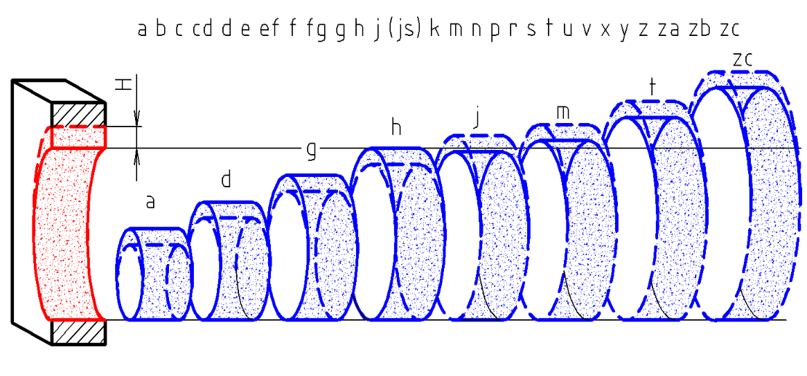
* Základní uložení hřídele
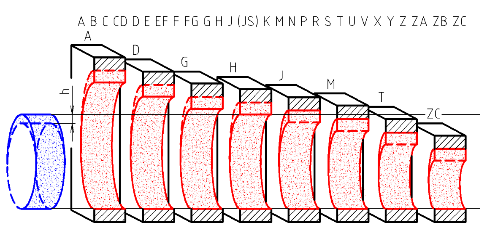
* Zápis
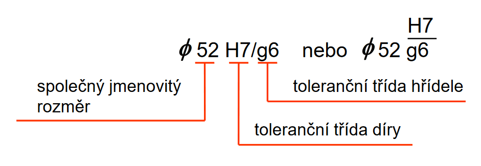
* Doporučená uložení:
  1. Uložení s vůlí:
     * H11/d11 - uložení se značnou vůlí
     * H7/f7 - točné uložení
     * H7/g7 - točné uložení - s velmi malou vůlí, dobré pro mazání
     * H8/h7, H8/h8 - smykové uložení - součásti jež se dají lehce do sebe zasunout a oddělat rukou
     * H7/h6 - Smykové uložení s velkou vůlí (u strojů)
  2. Uložení přechodná:
     * H7/js6, H7/j6 - posuvné uložení s nepatrnou vůlí nebo nepatrným přesahem (Snadná montáž a demontáž)
     * H7/k6 - Shodné uložení obvykle již s nepatrným přesahem (montáž a demontáž vyžaduje mírný tlak - musí se upevnit proti otáčení)
     * H7/n6 - Pevné uložení zpravidla již s malým přesahem (ke spojení a  rozebrání součástí je třeba větší síly - musí se upevnit proti otáčení)
  3. Uložení s přesahem
     * H7/p6 - lisované uložení se zaručeným přesahem (používá se pro spojení kovových součástí)
     * H7/r6 - lisované uložení se zaručeným přesahem (používá se často pro uložení bronzových ložiskových pouzder)
     * H7/s6 - Lisované uložení s velkým přesahem (součásti se dají složit nebo rozebrat jen velkým tlakem nebo za tepla)

## Všeobecné tolerance
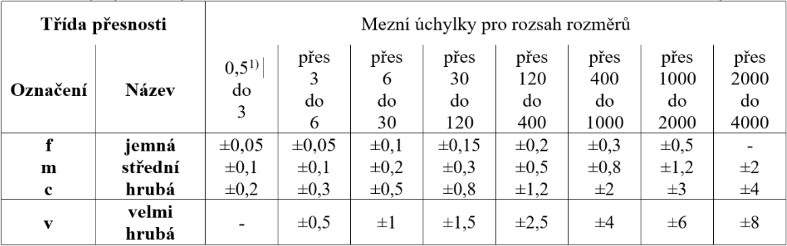
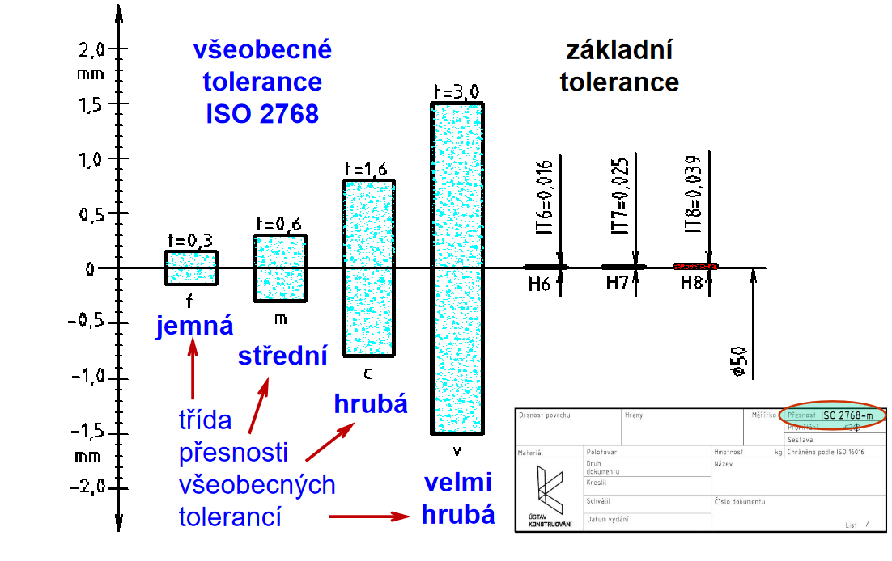

# Tolerování textury povrchu (drsnost)
* definice - náhodné úchylky od přesného geometrického tvaru plochy způsobené výrobou
* 3 složky:
  * Drsnost povrchu - R
  * Vlnitost povrchu - W
  * Základní profil - P
  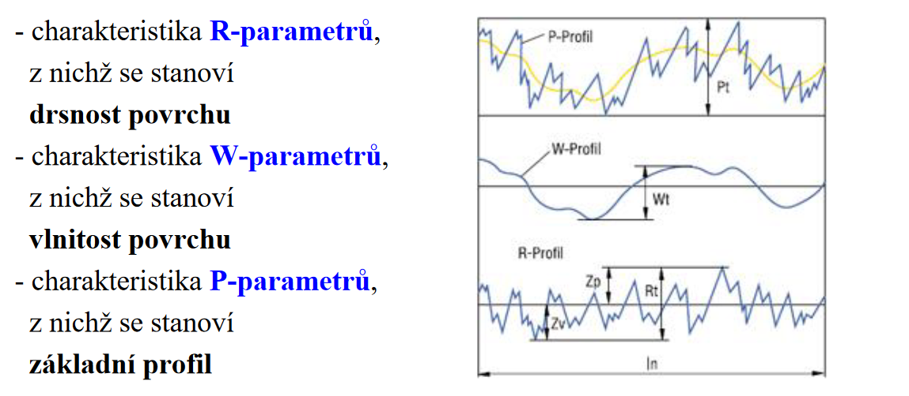
* Hodnocení povrchu:
  * profilová metoda - hrotem - jeden řez 
  * plošná metoda - opticky - celá plocha
* Filtrování - "odstranění vlny"
  * 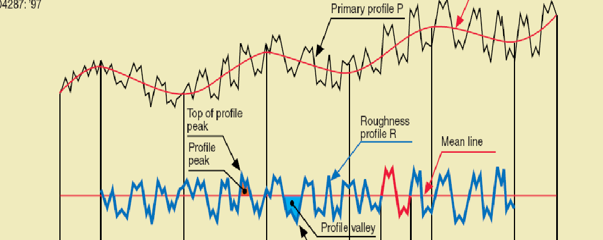
* ## Profil drsnosti:
  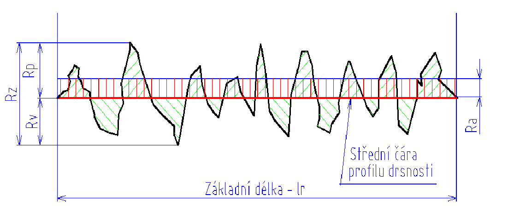
  * $R_p$ - hloubka prohlubně
  * $R_v$ - hloubka výstupku
  * $R_z$ - největší výška profilu $R_z$ = $R_vmax$ + $R_pmax$
  * $R_a$ - průměrná aritmetická úchylka $R_a = \frac{1}{1_r}* \int_{1_r}^{0}/Z(x)*dx$ 
  * $R_q$ - průměrná kvadratická úchylka $R_q = \frac{1}{1_r}* \int_{1_r}^{0}/Z^2(x)*dx$ (je o něco výš než $R_a$)

* ## Předpis:
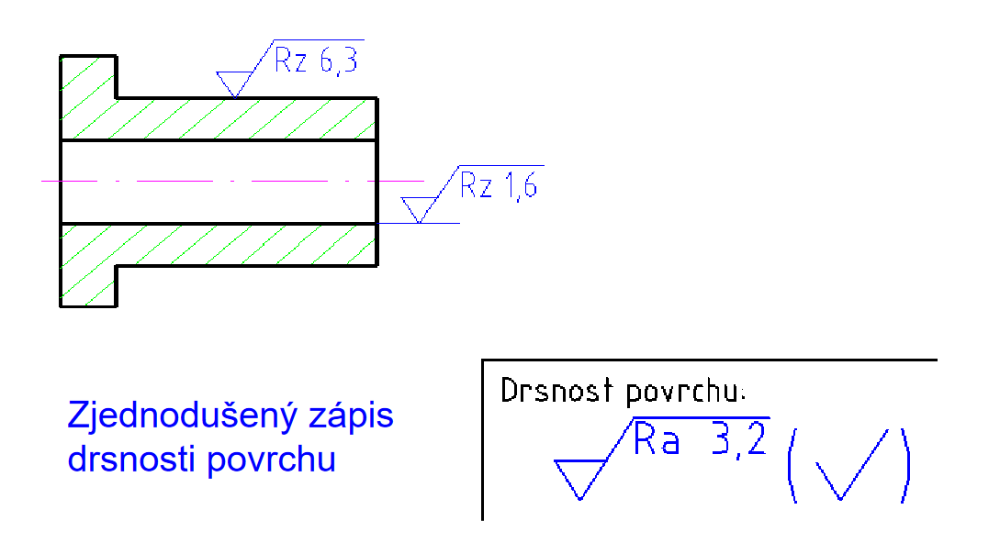
* Varianty:
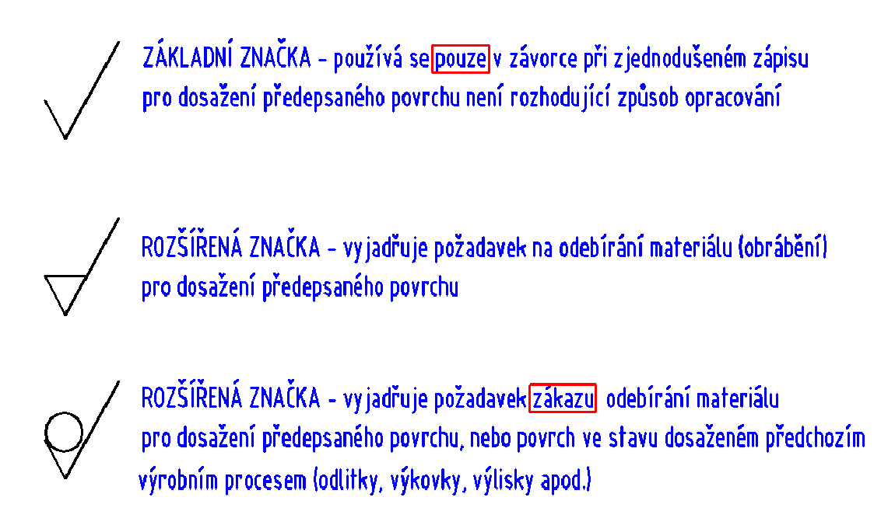
---
# Geometrické tolerance
- jsou používány nad rámec délkových tolerancí, definují přesněji tvar funkčních ploch
- přesnosti:
  1. pro jeden prvek - tvaru
  2. vůči všem - orientace, umístění, házení
## Značka:
* šipka je vždy kolmo na součást
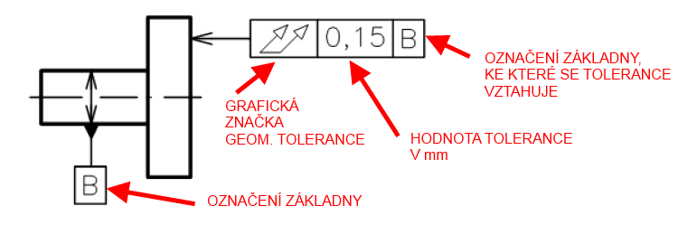
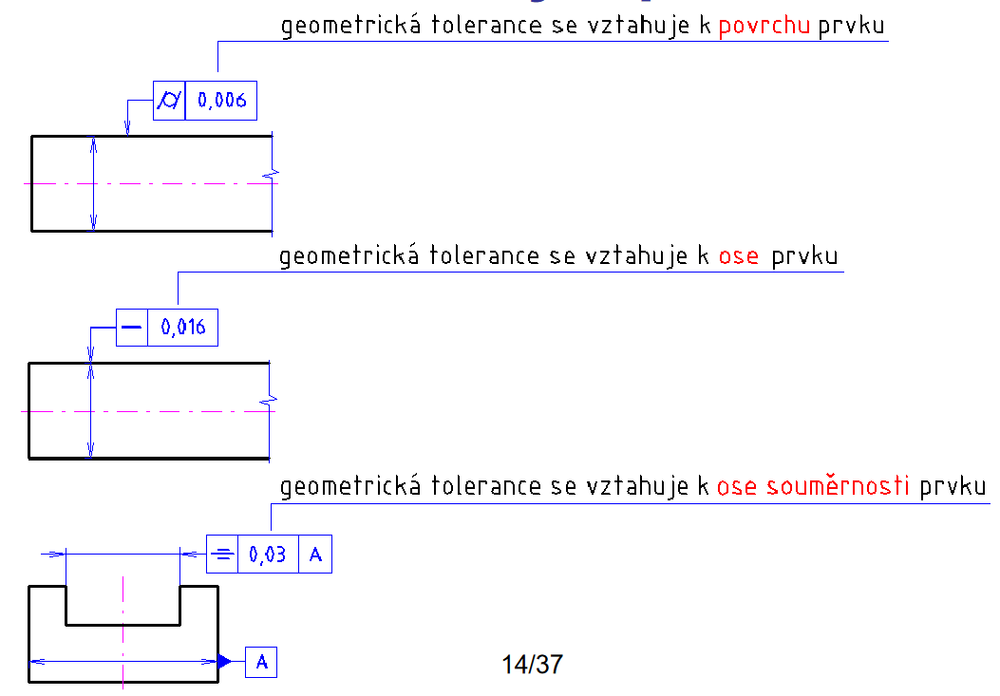
## Ohraničení
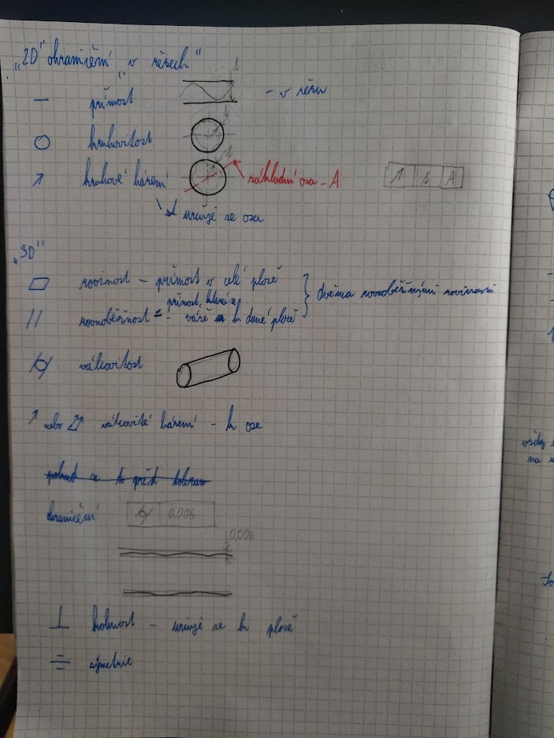
## Všeobecné tolerance
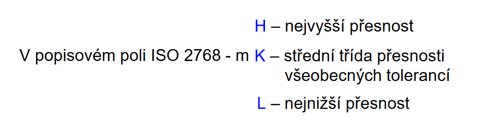