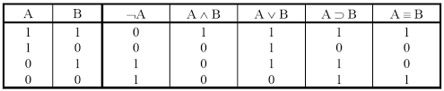

# Výroková logika
p(A) = 0, 1 - Pouze 2 stavy - pravda/lež

* ∧ - a zároveň - konjunkce 
* ∨ - nebo - disjunkce
* ⇒ - jestilže pak - implikace
* ⇔ - právě tehdy, když - ekvivalence
* ¬ nebo ´ - negace - opak

* Tautologie = výrok vždy platí

### Vztahy:
* $A ∧ B = B ∧ A$
* $A ∨ B = B ∨ A$
---
* $A ∧ (B ∧ C) = (A ∧ B) ∧ C$
* $A ∨ (B ∨ C) = (A ∨ B) ∨ C$
---
* $A ∧ (B ∨ C) = (A ∧ B) ∨ (A ∧ C)$
* $A ∨ (B ∧ C) = (A ∨ B) ∧ (A ∨ C)$
---
* $¬(¬A) = A$
* $¬(A ∧ B) = ¬A ∨ ¬B$
* $¬(A ∨ B) = ¬A ∧ ¬B$
* $¬(A ⇒ B) = A ∧ ¬B$
* $¬(A ⇔ B) = (A ∨ B) ∧ (¬A ∨ ¬B)$
