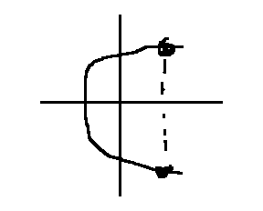

# Výroková logika
p(A) = 0, 1 - Pouze 2 stavy - pravda/lež

* ∧ - a zároveň - konjunkce 
* ∨ - nebo - disjunkce
* ⇒ - jestilže pak - implikace
* ⇔ - právě tehdy, když - ekvivalence
* ¬ nebo ´ - negace - opak

* Tautologie = výrok vždy platí

### Vztahy:
* A ∧ B = B ∧ A
* A ∨ B = B ∨ A
---
* A ∧ (B ∧ C) = (A ∧ B) ∧ C
* A ∨ (B ∨ C) = (A ∨ B) ∨ C
---
* A ∧ (B ∨ C) = (A ∧ B) ∨ (A ∧ C)
* A ∨ (B ∧ C) = (A ∨ B) ∧ (A ∨ C)
---
* ¬(¬A) = A
* ¬(A ∧ B) = ¬A ∨ ¬B
* ¬(A ∨ B) = ¬A ∧ ¬B
* ¬(A ⇒ B) = A ∧ ¬B
* ¬(A ⇔ B) = (A ∨ B) ∧ (¬A ∨ ¬B)

Zobrazení vs funkce
Funkce nesmí mít 2 hodnoty pro X
Pokud tedy "graf" obrahuje 2 hodnoty pro x jedná se o zobrazení

# Matice
A ∈ $R^{m*n}$ => A je typu (m,n)... m = počet řádků, n = počet sloupců
* A(n,n) = čtvercová matice
* 0 = nulová matice.. obrahuje pouze nuly
* E / I = Jedničková.. Jedničky jsou na diagonále, !vždy musí být čtverec
* D / H = Dolní/horní trojúhelníková matice (Obsahuje 0 v horním nebo dolním "trojúhelníku")

### Vlastnosti
* Rovnost - A = B - jedině pouze jsou všechny čísla ve sloupcích a řádcích stejná
* Transpozice - $A^{T}$=$a_{ij}^{T}$=$a_{ij}$ 
$(A^{T})^{T}$ = A
* Skalární násobení - c * A = c * ($A_{ij}$) - každé číslo matice se vynásobí hodnotou c
*  Součet - A + B - jde pouze když jsou stejné (m,n) = (m,n) obou matic, sčítá se každá pozice v matici s tou druhou
*  Odčítání - stejné jako u součtu jen se zapisuje - A + (-1)*B
*  Násobení - A * B = C  Př: 
