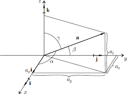
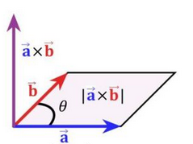
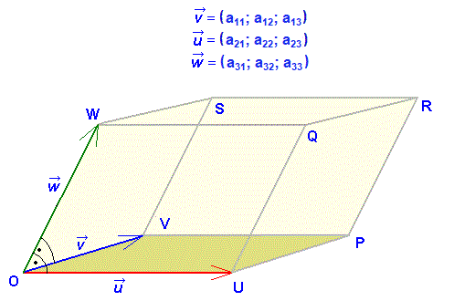

# Analitická geometrie
* Bod
  * $A=[A_x, A_y, A_z]$
* Vektor
  * $\vec{u} = (u_x, u_y, u_z)$
* Vázaný vektor:
  * $\vec{AB}=(x_B-x_A, y_B-x_A, z_B-x_A)$
* Nulový vektor:
  * $\vec{O}=(0,0,0)$
* Kanonická báze
  * $\vec{i}=(1,0,0)$
  * $\vec{j}=(0,1,0)$
  * $\vec{k}=(0,0,1)$
    * $\vec{u}=u_x*\vec{i}, u_y*\vec{j}, u_z*\vec{k}$

### Vzorce:
* Výpočet délky:
  * $|\vec{u}|=\sqrt{u_x^2, u_y^2, u_z^2}$
* Úhly    
 
  * $u_x=|\vec{u}|*\cos\alpha$
  * $u_y=|\vec{u}|*\cos\beta$
  * $u_z=|\vec{u}|*\cos\gamma$

### Operace:
* Součet
  * Výsledkem je vektor
  * $\vec{u}+\vec{v}=(u_x+v_x, u_y+v_y, u_z+v_z)$
  * $c*\vec{u}=(c*u_x, c*u_y, c*u_z)$
* Skalární součin (
  * Výsledkem je číslo
  * Určuje kolmost
  * $\vec{u}*\vec{v}=(u_x*v_x, u_y*v_y, u_z*v_z)$
  * $\vec{u}*\vec{v}=|\vec{u}|*|\vec{v}|*\cos\alpha$
  * pokud $\vec{u}*\vec{v}=0$ vektory jsou na sebe kolmé
    * $(3,4,1)*(6,2,7)=3*6+4*2+1*7=18+8+7=33$
* Vektorový součin
  * Výsledek je vektor, který je na oba vektor kolmý
  * Je roven ploše vektorů viz. obrázek
  * $\vec{u}$ x $\vec{v}=\vec{w}$      
  
  * $S=\vec{w}=\vec{u}*\vec{v}*\sin\alpha$
  * $\vec{u}$ x $c*\vec{v}=\vec{0}=(0,0,0)$
  * $\vec{u}$ x $\vec{v}=\begin{pmatrix}\vec{i} & \vec{j} & \vec{k}\\ u_x & u_y & u_z\\ v_x & v_y & v_z\end{pmatrix}$
  * $\vec{u}$ x $\vec{v}=-\vec{u}$ x $\vec{v}$
    * $\vec{a}=(2,3,-1)$
    * $\vec{b}=(1,-2,3)$
    * $\vec{a}$ x $\vec{b}=\begin{pmatrix}\vec{i} & \vec{j} & \vec{k}\\ 2 & 3& -1\\ 1&-2&3\end{pmatrix}=9\vec{i}-\vec{j}-4\vec{k}-2\vec{i}-6\vec{j}-3\vec{k}=7\vec{i}-7\vec{j}-7\vec{k}$
* Smíšený součin 
  * Výsledkem je číslo, které je zároveň "objemem" viz obrázek
  * 
  * $[uvw]=\vec{u}*(\vec{v}$ x $\vec{w})=\begin{pmatrix}u_x & u_y & u_z \\ v_x & v_y & v_z \\ w_x & w_y & w_z\end{pmatrix}$
  * Pokud $[avw]=0$ vektory jsou lineárně závislé, nebo-li jsou v jedné rovině
    * $vec{a}=(4,5,1)$
    * $vec{b}=(8,7,-3)$
    * $vec{c}=(1,2,0)$
    * $[abc]=\begin{pmatrix}4 & 5 & -1 \\ 8 & 7 & -3 \\ 1 & 2 & 0\end{pmatrix}=0-15-16+24+0+7=0$
