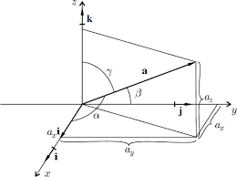

# Analitická geometrie
* Bod
  * $A=[A_x, A_y, A_z]$
* Vektor
  * $\vec{u} = (u_x, u_y, u_z)$
* Vázaný vektor:
  * $\vec{AB}=(x_B-x_A, y_B-x_A, z_B-x_A)$
* Nulový vektor:
  * $\vec{O}=(0,0,0)$
* Kanonická báze
  * $\vec{i}=(1,0,0)$
  * $\vec{j}=(0,1,0)$
  * $\vec{k}=(0,0,1)$
    * $\vec{u}=u_x*\vec{i}, u_y*\vec{j}, u_z*\vec{k}$

### Vzorce:
* Výpočet délky:
  * $|\vec{u}|=\sqrt{u_x^2, u_y^2, u_z^2}$
* Úhly    
 
  * $u_x=|\vec{u}|*\cos\alpha$
  * $u_y=|\vec{u}|*\cos\beta$
  * $u_z=|\vec{u}|*\cos\gamma$

### Operace:
* Součet
  * Výsledkem je vektor
  * $\vec{u}+\vec{v}=(u_x+v_x, u_y+v_y, u_z+v_z)$
  * $c*\vec{u}=(c*u_x, c*u_y, c*u_z)$
  
* Skalární součin (
  * Výsledkem je číslo
  * Pokud je výsledkem 0... vektory jsou kolmé
  * $\vec{u}*\vec{v}=(u_x*v_x, u_y*v_y, u_z*v_z)$
  * $\vec{u}*\vec{v}=|\vec{u}|*|\vec{v}|*\cos\alpha$ z toho je možné vyjádřit $\cos\alpha$
  * $\cos\alpha=\frac{u * v}{|u|*|v|}=\frac{u_1 * v_1+u_2 * v_2+u_3*v_3}{\sqrt{u_1^2+u_2^2+u_3^2}*\sqrt{v_1^2+v_2^2+v_3^2}}$
  * pokud $\vec{u}*\vec{v}=0$ vektory jsou na sebe kolmé
    * $(3,4,1)*(6,2,7)=3*6+4*2+1*7=18+8+7=33$
  
* Vektorový součin
  * Výsledek je vektor (ve 2D skalár), který je na oba vektor kolmý
  * Je roven ploše vektorů viz. obrázek
  * $\vec{u}$ x $\vec{v}=\vec{w}$      
  
  * $S=\vec{w}=\vec{u}*\vec{v}*\sin\alpha$
  * $\vec{u}$ x $c*\vec{v}=\vec{0}=(0,0,0)$
  * $\vec{u}$ x $\vec{v}=\begin{pmatrix}\vec{i} & \vec{j} & \vec{k}\\ u_x & u_y & u_z\\ v_x & v_y & v_z\end{pmatrix}$
  * $\vec{u}$ x $\vec{v}=-\vec{u}$ x $\vec{v}$
    * $\vec{a}=(2,3,-1)$
    * $\vec{b}=(1,-2,3)$
    * $\vec{a}$ x $\vec{b}=\begin{pmatrix}\vec{i} & \vec{j} & \vec{k}\\ 2 & 3& -1\\ 1&-2&3\end{pmatrix}=9\vec{i}-\vec{j}-4\vec{k}-2\vec{i}-6\vec{j}-3\vec{k}=7\vec{i}-7\vec{j}-7\vec{k}$

* Smíšený součin 
  * Výsledkem je číslo, které je zároveň "objemem" viz obrázek
  * 
  * $[uvw]=\vec{u}*(\vec{v}$ x $\vec{w})=\begin{pmatrix}u_x & u_y & u_z \\ v_x & v_y & v_z \\ w_x & w_y & w_z\end{pmatrix}$
  * Pokud $[avw]=0$ vektory jsou lineárně závislé, nebo-li jsou v jedné rovině
    * $\vec{a}=(4,5,1)$
    * $\vec{b}=(8,7,-3)$
    * $\vec{c}=(1,2,0)$
    * $[abc]=\begin{pmatrix}4 & 5 & -1 \\ 8 & 7 & -3 \\ 1 & 2 & 0\end{pmatrix}=0-15-16+24+0+7=0$

### Lineární množiny v rovině
* Přímka v rovině:
  * 4 způsoby zápisu:
    1. obecná rovnice přímky
       * $a*x + b*y + c = 0$ (kde $a,b,c\in R$)
       * Není jednoznačná, neboť každý násobek rovnice je furt stejná přímka
       * Neznámé $a,b$ určují tzv. "normálový" vektor $n=(a,b)$, kterým se dá získat "směrový" vektor $s=(-a,b)$
       * V případě $a=0$ přímka je rovnobězná s osou x
       * V případě $b=0$ přímka je rovnobězná s osou y
       * Pokud $a\ne0$, tak přímka protíná osu $x$ v bodě $[-\frac{a}{c},0]$. Pokud $b\ne0$, tak přímka protíná osu $y$ v $[0,-\frac{b}{c}]$
    2. směrnicová rovnice přímky
       * $y=kx+q$ (kde $k,q\in R$. Číslo $q$ je souřadnice průsečíku s osou $y$, $k$ je tzv. "směrnice") 
       * Nedokáže popsat rovnobězné přímky na osu $y$
       * Směrový vektor $s=(1,k)$, Normálový vektor $n=(-k,1)$
       * Číslo $q$ určuje průsečík $[0,q]$ s osou $y$
       * Pokud $k=0$ přímka je rovnobězná na osu $x$. Pro $k\ne0$ tak protíná osu x v bodě $[-\frac{q}{k},0]$
    3. úseková rovnice přímky
       * $\frac{x}{p}+\frac{y}{q}=1$ (Kde $p,q\ne0$ jsou  ́useky, ktere přímka "vytíná" na osách $x, y$ tj. Průsečíky s osami jsou $[p, 0]$ a $[0, q]$)
       * Nedokáže určit přímky procházející počátkem
       * Převede-li se jednička "na druhou stranu", tak dostáváme obecnou rovnici
    4. parametrické rovnice přímky
       * $x=A_x+s_1*t$ , $y=A_y+s_2*t$ (Kde $A=[A_x,A_y]$ je bod, kterým přímka prochází a $s=(s_1,s_2)$ je její nenulový směrový vektor)
       * Rovnice dokáže popsat všechny přímky, avšak přímka má mnoho zápisů, protože může začínat z libovolného bodu přímky
       * Směrový vektor $s=(s_1,s_2)$, Normálový vektor $n=\pm(-s_2,s_1)$

### Vzorce ve 2d
* Vzdálenost dvou různých bodů (vzniká vektor)
  * $|B-A|=\vec{AB}=\sqrt{(x_B-x_A)^2+(y_B-x_A)^2}$
* Vzdálenost bodu od přímky
  * $d=\frac{|a*x+b*y+c|}{\sqrt{a^2+b^2}}$
* Vzájemná dvou přímek v rovině
  1. různoběžné - mají jeden společný bod, průsečík - pokud mají směrové vektory (normálové vektory) odlišné
     * Odchylku 2 různoběžných přímek vypočítáme pomocí směrových vektorů:
       *  $\cos\alpha=\frac{|s_p*s_q|}{|s_p|*|s_q|}$
     * Kolmost je když $s_p * s_q = 0$  
  2. rovnoběžné - nemají žádný společný bod
  3. totožné
  *  Rovnobězné a totožné se dají od sebe odlišit tak, že se určíme jeden bod na jedné přímce a spočítáme vzdálenost bodu od přímky
  *  Vzdálenost dvou rovnoběžných přímek, kdy $p=ax+by+c_p=0$ a $q=ax+by+c_q=0$:
     *  $d=\frac{|c_p-c_q|}{\sqrt{a^2+b^2}}$

### Vzorce:
* Délka vektoru
  * $|u|=\sqrt{u * u} = \sqrt{u^2_1+u^2_2+ \cdot + u^2_n}$

* Úhel dvou vektorů
  * $\cos\alpha=\frac{u * v}{|u|*|v|}=\frac{u_1 * v_1+u_2 * v_2+u_3*v_3}{\sqrt{u_1^2+u_2^2+u_3^2}*\sqrt{v_1^2+v_2^2+v_3^2}}$
