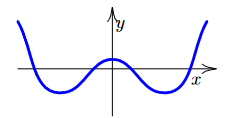

# Funkce
$D(f)$ - obor všech $x$ v dané funkci
$H(f)$ - obor všech $y$ v dané funkci

* Funkce nikdy nesmí mít 2 hodnoty pro $x$
* Př: 

## Sudost/Lichost
* Sudá
  * $f(-x)=f(x)$ pro $\forall x \in D(f)$
  * Souměrná podle osy y 
  * 
* Lichá
  * $f(-x)=-f(x)$ pro $\forall x \in D(f)$
  * Středově souměrná
  * 
* Ani sudá ani lichá
  * Ve většině případů funkce nebude splňovat sudost ani lichost
## Periodičnost
* pro $p>0: f(x+p)=f(x)$ pro $\forall x=D(f)$
* pro $sin(x)$ a $cos(x)$ $p=2\pi$
* pro $tg(x)$ a $cotg(x)$ $p=\pi$
## Rostoucí/Klesající/Konstantní
* Klesající
* Nerostoucí - konstantní a klesající
* Rostoucí
* Neklesající - konstantní a rostoucí
* Konstantní
## Omezenost
* Dolně/horně/dolně i horně/neomezená
## Složená funkce
* funkce obsahující další funkci
## Inverzní funkce
